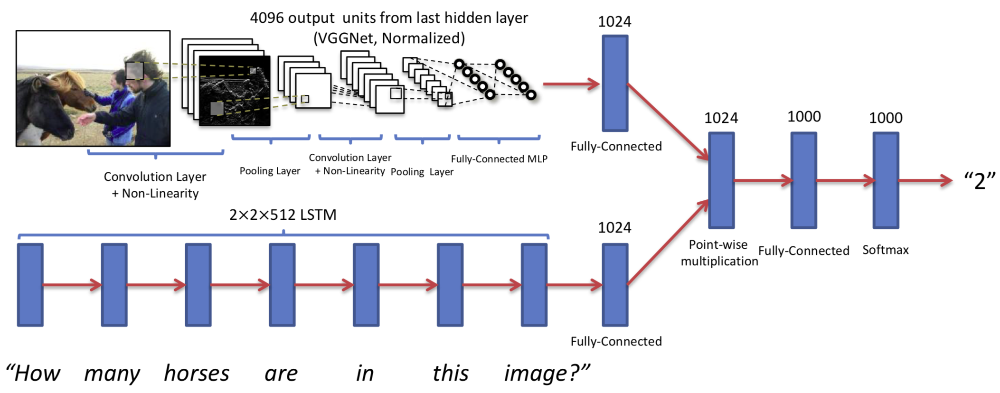

# visual_question_answering
Pytorch implementation of the following papers 
- VQA: Visual Question Answering (https://arxiv.org/pdf/1505.00468.pdf).
- Stacked Attention Networks for Image Question Answering (https://arxiv.org/abs/1511.02274)
- Making the V in VQA Matter: Elevating the Role of Image Understanding in Visual Question Answering (https://arxiv.org/abs/1612.00837)
- Bottom-Up and Top-Down Attention for Image Captioning and Visual Question Answering (https://arxiv.org/abs/1707.07998)




## Directory and File Structure
```
.
+-- datasets/
|   +-- images/
|       +-- test2015/
|           +-- COCO_test2015_000000000001.jpg
|           +-- COCO_test2015_000000000014.jpg
|           +-- ...
|       +-- train2014/
|           +-- COCO_train2014_000000000009.jpg
|           +-- COCO_train2014_000000000025.jpg
|           +-- ...
|       +-- val2014/
|           +-- COCO_val2014_000000000042.jpg
|           +-- COCO_val2014_000000000073.jpg
|           +-- ...
|   +-- Questions/
|       +-- v2_OpenEnded_mscoco_test2015_questions.json
|       +-- v2_OpenEnded_mscoco_test-dev2015_questions.json
|       +-- v2_OpenEnded_mscoco_train2014_questions.json
|       +-- v2_OpenEnded_mscoco_val2014_questions.json
|   +-- Annotations/
|       +-- v2_mscoco_train2014_annotations.json
|       +-- v2_mscoco_val2014_annotations.json
|   +-- test.npy
|   +-- test-dev.npy
|   +-- train.npy
|   +-- train_valid.npy
|   +-- valid.npy
|   +-- vocab_answers.txt
|   +-- vocab_questions.txt
```


## Usage 
#### 1. Prepare an environment
This is a preparation step for local machines with CUDA Gpu
create python 3.8.12 on conda env
```bash
$ conda install pytorch torchvision torchaudio cudatoolkit=10.2 -c pytorch
```
install required ppackages as the system needs

#### 2. Clone the repositories.
```bash
$ git clone https://github.com/SunWuChoi/Vqa_Project.git
```

#### 3. Download and unzip the dataset from official url of VQA: https://visualqa.org/download.html.
We have used VQA2 in for this project
Download VQA Annotations, VQA Input Questions, and VQA Input Images and unzip them to the datasets folder to match the directory structure

### VQA Annotations
- v2_Annotations_Train_mscoco.zip - https://s3.amazonaws.com/cvmlp/vqa/mscoco/vqa/v2_Annotations_Train_mscoco.zip
- v2_Annotations_Val_mscoco.zip - https://s3.amazonaws.com/cvmlp/vqa/mscoco/vqa/v2_Annotations_Val_mscoco.zip

### VQA Input Questions
- v2_Questions_Train_mscoco.zip - https://s3.amazonaws.com/cvmlp/vqa/mscoco/vqa/v2_Questions_Train_mscoco.zip
- v2_Questions_Val_mscoco.zip - https://s3.amazonaws.com/cvmlp/vqa/mscoco/vqa/v2_Questions_Val_mscoco.zip
- v2_Questions_Test_mscoco.zip - https://s3.amazonaws.com/cvmlp/vqa/mscoco/vqa/v2_Questions_Test_mscoco.zip

### VQA Input Images (COCO)
- train2014.zip - http://images.cocodataset.org/zips/train2014.zip
- val2014.zip - http://images.cocodataset.org/zips/val2014.zip
- test2015.zip - http://images.cocodataset.org/zips/test2015.zip


#### 4. Preproccess input data for (images, questions and answers).

run the preprocess notebook file to preprocess the datasets

#### 5. Train model for VQA task.
Go to the directory where train.py is and run the train with appropriate arguments you need
```bash
$ python train.py
```
#### 6. Plotting.
Use plotter notebook file to plot the results stored in the logs folder

## References
* Paper implementation
  + Keywords: Visual Question Answering ;
    
* Baseline Model
  + Github: https://github.com/tbmoon/basic_vqa
